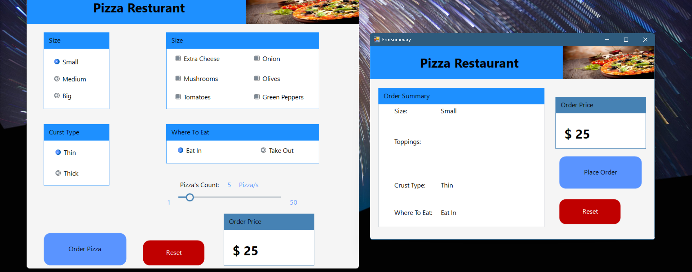

# 🍕 Pizza Ordering System - C# Windows Forms Application

[](https://docs.microsoft.com/en-us/dotnet/csharp/)
[](https://dotnet.microsoft.com/)
[](https://docs.microsoft.com/en-us/dotnet/desktop/winforms/)

> A comprehensive pizza ordering system built with C# Windows Forms as part of Course 14 - Programming Advices. This project demonstrates advanced programming concepts including GUI design, event handling, and object-oriented programming principles.

## 📺 Video Tutorial

[](https://www.youtube.com/watch?v=-YauBKtpjrs)

**Watch the complete tutorial:** [Pizza Project - C# Windows Forms Development](https://www.youtube.com/watch?v=-YauBKtpjrs)

## 🚀 Features

- **Interactive Pizza Ordering Interface** - User-friendly GUI for placing pizza orders
- **Customizable Pizza Options** - Multiple toppings, sizes, and crust types
- **Order Management** - Add, modify, and remove items from cart
- **Modern UI Design** - Clean and professional interface using Guna.UI2 components
- **Real-time Price Calculation** - Dynamic pricing based on selected options
- **Order Summary** - Detailed breakdown of selected items and total cost

## 📸 Application Screenshots

### Main Interface


### Order Placement Screen


### Pizza Customization


### Order Configuration


### Additional Features


### Application Flow


### Final Order Summary


## 🛠️ Technologies Used

- **Language:** C# (.NET Framework)
- **UI Framework:** Windows Forms
- **UI Components:** Guna.UI2 (Modern UI Library)
- **IDE:** Visual Studio
- **Architecture:** Object-Oriented Programming (OOP)

## 📁 Project Structure

```
PizzaProject/
│
├── 📄 Program.cs              # Application entry point
├── 📄 FrmMain.cs              # Main form implementation
├── 📄 FrmPlaceOrder.cs        # Order placement form
├── 📄 BaseForm.cs             # Base form class
├── 📄 FontManager.cs          # Font management utilities
├── 📄 Form1.cs                # Additional form component
│
├── 📂 Properties/             # Assembly and resource properties
├── 📂 Resources/              # Application resources (images, etc.)
├── 📂 PicturesGit/           # Project screenshots and documentation images
├── 📂 bin/                   # Compiled application files
└── 📂 obj/                   # Build artifacts
```

## 🎯 Key Programming Concepts Demonstrated

- **Windows Forms Development** - Creating responsive desktop applications
- **Event-Driven Programming** - Handling user interactions and form events
- **Object-Oriented Design** - Implementing classes, inheritance, and encapsulation
- **UI/UX Design Principles** - Creating intuitive and user-friendly interfaces
- **Resource Management** - Efficient handling of images and application resources
- **Form Navigation** - Managing multiple forms and user workflow

## 🚀 Getting Started

### Prerequisites
- Visual Studio 2019 or later
- .NET Framework 4.7.2 or higher
- Guna.UI2 NuGet package

### Installation

1. **Clone the repository**
   ```bash
   git clone <repository-url>
   cd PizzaProject
   ```

2. **Open the solution**
   - Open `PizzaProject.sln` in Visual Studio

3. **Restore NuGet packages**
   - Right-click on the solution in Solution Explorer
   - Select "Restore NuGet Packages"

4. **Build and run**
   - Press `F5` or click "Start" to build and run the application

## 🎮 How to Use

1. **Launch the Application** - Run the executable or start from Visual Studio
2. **Navigate the Main Menu** - Explore different options available
3. **Place an Order** - Click on "Place Order" to start ordering
4. **Customize Your Pizza** - Select size, crust, and toppings
5. **Review Order** - Check your selections and total price
6. **Complete Order** - Finalize your pizza order

## 🎓 Learning Objectives

This project helps developers learn:

- ✅ Advanced Windows Forms development techniques
- ✅ Modern UI design with third-party components
- ✅ Event handling and form validation
- ✅ Object-oriented programming best practices
- ✅ Resource management and application deployment
- ✅ User experience design principles

## 🤝 Contributing

This project is part of an educational course. Feel free to:

- Report issues or bugs
- Suggest improvements
- Fork the project for your own learning
- Share your modifications and enhancements

## 📝 License

This project is created for educational purposes as part of Programming Advices Course 14.

## 🙏 Acknowledgments

- **Programming Advices** - For providing excellent C# programming education
- **Guna.UI2** - For the modern and professional UI components
- **Microsoft** - For the robust .NET Framework and Visual Studio IDE

---

<div align="center">

### 📚 Part of Programming Advices Course Series

*Mastering C# Windows Forms Development*

[](https://www.youtube.com/watch?v=-YauBKtpjrs)

</div>
